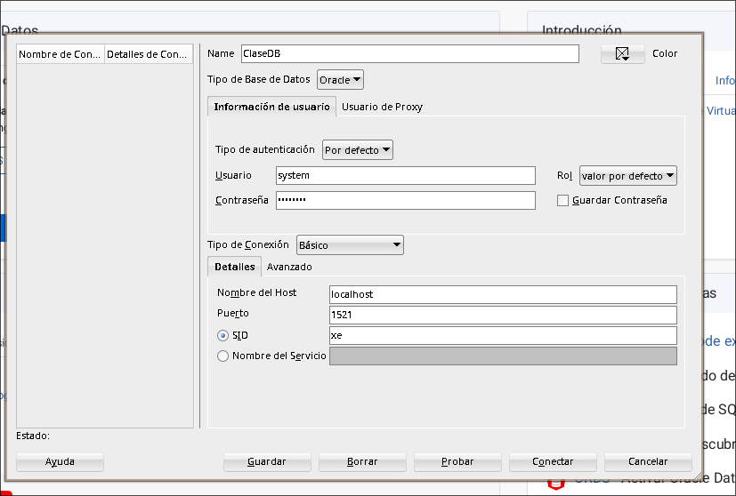

# Guia de Instalación de Oracle Ex con Docker

## Introducción

En esta guía se vera como instalar oracle-ex usando docker. Este projecto esta hecho para documentar
como he instalado oracle-ex en Arch Linux, ya que otras formas de instalar esta base de datos no 
han sido fructiferas, sin embargo este metodo sirve para instalar la base de datos en cualquier distribución
de Linux.

Los pasos a seguir seran: 
 - Descargar la imagen de oracle-ex
 - Crear y configurar un contenedor
 - Ejecutar el contenedor 
 - Conectar Oracle SQL Developer a la base de datos

## Requisitos 

Tener instalado docker (poner una guia de instalación de docker).

## Instalar Imagen

Hay dos formas de instalar la imagen:
  - Te haces una sesión en Oracle y te instalas la imagen de ahí
  - Te instalas la imagen de docker hub

En esta guía se ahara lo segundo por cuestiones de comodidad.

Para instalar la última imagen ejecutaremos el siguiente comando:

```bash
  > docker pull gvenzl/oracle-xe
```

Con esto ya estara instalada la imagen de docker.

## Crear y Configurar Container 

Para crear el container usaremos el siguiente comando: 

```bash
  > docker run -d --name oracle-db -p 1521:1521 -p 5500:5500 -e ORACLE_PASSWORD=admin123 gvenzl/oracle-xe:latest
```

Voy a explicar un poco que hace el comando.

el argumento run sirve para crear el contenedor y ejecutarlo.
el parametro --name da nombre al al contenedor (le puedes poner cualquier nombre, no hace falta que sea 
oracle-db, como si le llamas sasel)

el comando -p sirve para espcificar el puerto. He puesto este parametro, ya que el puerto 1521 es para
oracle-ex y el 5500 es para realizar la cenxión con el SQL Develepor.

Se la estructuar puerto:puerto debido a que el primer puerto es el que se usa dentro del contenedor y el
segundo es el que usa tu maquina.

-e sirve para especificar las variables de entorno, en este caso se espicifa la contraseña del administrador.
En Oracle, por defecto, el administrador se llamo system.

Lo último que se pone es el nombre de la imagen.

### Verificar que el contenedor funciona 

Para esto ejecutaremos este comando para ver que se a creado correctamente:

```bash
  > docker ps
```

Si todo va bien debería devolver un output parecido a este: 


Y despues debemos entrar a los logs del contenedor para verificar que se no hay ningún problema 

```bash 
   ❯ docker logs oracle-db
```
Deberia de salir un input parecido a este: 

#########################
DATABASE IS READY TO USE!
#########################

## Conectar Oracle Express a Oracle SQL Developer

Nos vamos a Oracle SQL Developer, y le damos click a crear una conoxión manualmente.


Rellenamos todos los campos como muestra la imagen IMPORTANTE el usuario debe ser system para poder acceder 
(luego puedes crear otros usuarios con sus propios privilegios para no acceder siempre como administrador)
y la contraseña es la misma que la puesta al crear el contenedor de docker.

El nombre de la conexión puede ser cuarquier cosa.



Das click a probar y si no da error conectas y volar.
